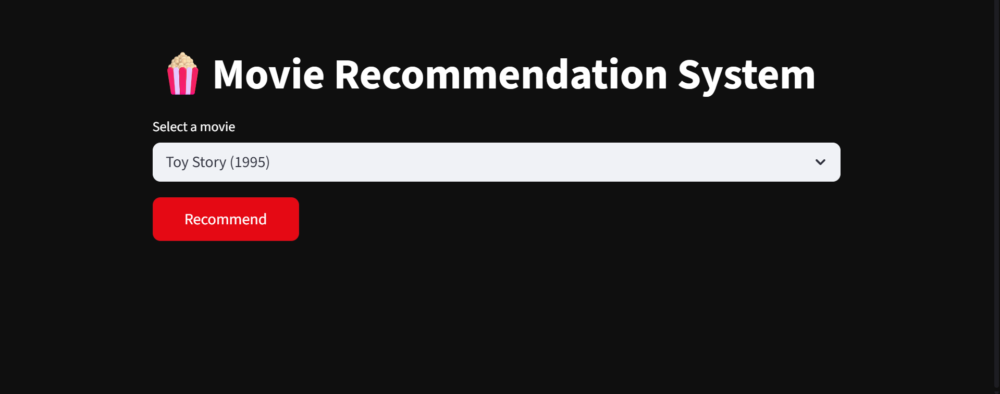
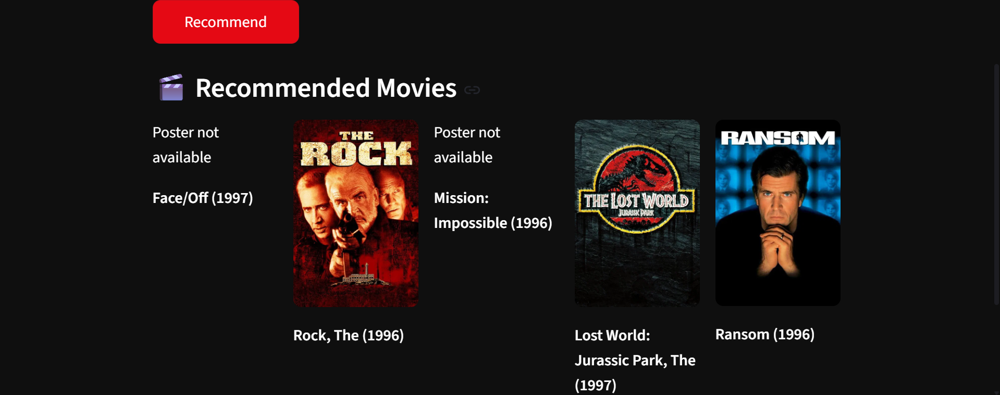

# Movie Recommendation System

This is a Machine Learning-based Movie Recommendation System that suggests movies based on user preferences.

---

## Features

* Recommend movies using collaborative filtering
* Uses cosine similarity algorithm
* Built using Python, Pandas, NumPy, and Scikit-learn
* Interactive web app using Streamlit
* Displays movie posters using TMDB API

---

## Tech Stack

* Python
* Pandas
* NumPy
* Scikit-learn
* Streamlit

---

## Dataset

* MovieLens 100K dataset

---

## How to Run

1. Install dependencies:

```
pip install pandas numpy scikit-learn streamlit requests
```

2. Run the app:

```
streamlit run app.py
```

---
## Output

### Home Page


### Recommendations


---

## Future Improvements

* Add better UI (Netflix-style)
* Improve recommendation accuracy
* Deploy online

---

## Author

Uppari Meghana
